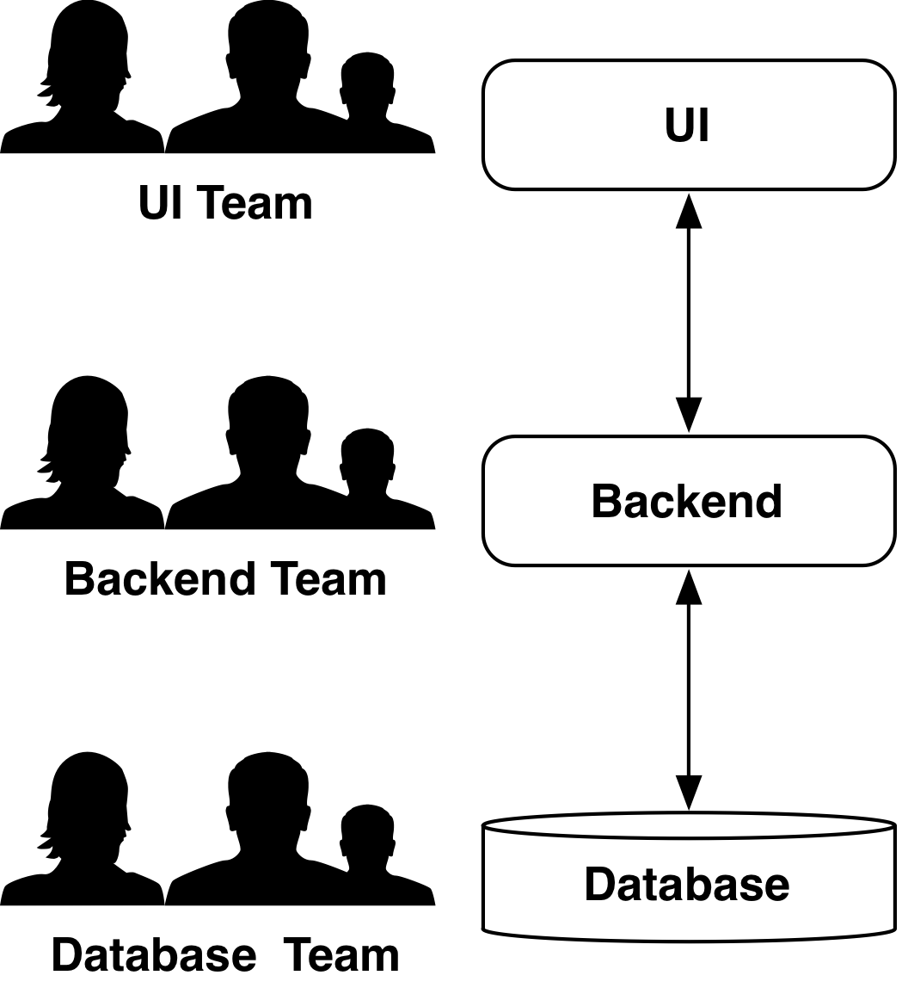
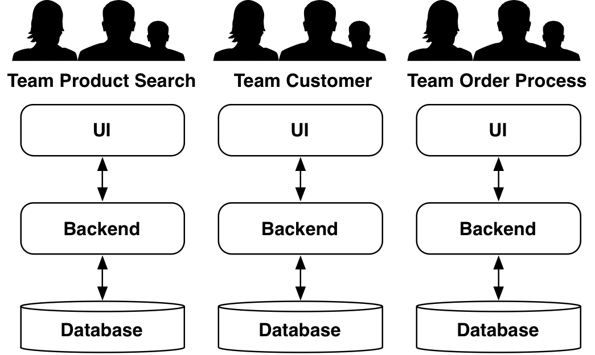

# 2 What Are Microservices? {#chapter-2}

The idea behind Microservices is not new. A very similar approach
is also followed by the UNIX philosophy, which is based on three
ideas:

* A program should fulfill only one task, and it should do it well.

* Programs should be able to work together.

* Besides, the programs should use a universal interface. In UNIX
these are text streams.

The realization of these ideas leads to the creation of reusable
programs, which are in the end a kind of component.

Microservices serve to divide large systems. Consequently,
Microservices represent a modularization concept. There is a large
number of such concepts, but Microservices are different. They can be
brought into production independently of each other. Changes to an
individual Microservice only require that this Microservices has to be
brought into production. In the case of other modularization concepts
all modules have to be delivered together. Thus, a modification to an
individual module necessitates that the entire application with all
its modules has to be deployed again.

#### Microservice = Virtual Machine

Microservices cannot be implemented via the modularization concepts
of programming languages. These concepts usually require
that all modules have to be delivered together in one program. Instead
Microservices have to be implemented as virtual machines, as more
light-weight alternatives such as Docker containers or as individual
processes. Thereby they can all easily be brought into production
individually.

This results in a number of additional advantages: For instance,
Microservices are not bound to a certain technology. They can be
implemented in any programming language or on any platform. Moreover,
Microservices can of course also bring along their own supporting
services such as databases or other infrastructure.

Besides, Microservices should possess their own separate data storage i.e. a
separate database or at least a separate schema in a common
database. Consequently, each Microservice is in charge of its own
data. In fact, experience teaches that the shared use of database
schemas renders changes to the data structures practically
impossible. Since this interferes profoundly with software
changeability, this kind of coupling should be prevented.

#### Communication Between Microservices

Microservices have to be able to communicate with each other. This can
be achieved in different manners:

* The Microservices can replicate data. This does not just mean to
  copy the data without changing the schema. In that case changes to
  the scheme are impossible because multiple Microservices use the
  same schema. However, when one Microservice processes orders and
  another analyzes the data of the orders, the data formats can be
  different and also access to the data is different: The analysis Microservice
  will primarily read data, for order processing reading and
  writing are rather equal. Classical data warehouses also employ
  replication for analyzing large amounts of data.
  
* When Microservices possess an HTML UI, they can easily use links to
  other Microservices. Besides, it is possible that a Microservice
  integrates the HTML code of other Microservices in its own web page.
  
* Finally, the Microservices can communicate with each other by
protocols like REST or messaging via the network.

In a Microservice-based system it has to be defined which communication
variants are used to ensure that the Microservices can in fact be
reached with these technologies.

## 2.1 Size {#section2-1}

The term "Microservice" focuses on the size of Microservices. This
makes sense for distinguishing Microservices from other definitions of
"services". Nevertheless, it is not so easy to indicate the concrete
size of Microservices.

Defining the unit poses already a problem: Lines of Code (LoC) are not
a good unit. In the end, the actual number of Lines of Code of a
program does not only depend on its formatting, but also on the
programming language. In fact, it does not seem to make much sense to
evaluate an architectural approach based on such metrics. Ultimately,
the size of a system can hardly be given in absolute terms, but only
in relation to the represented business processes and their
complexity.

Therefore, it makes much more sense to define the size of
Microservices with the aid of upper and lower limits. In general, it
holds true that smaller is better for Microservices:

* A Microservice should be developed by one team. Therefore, a
  Microservice should never be so large that more than one team is
  necessary to develop it further.
  
* Microservices represent a modularization approach. Developers should
  be able to understand individual modules – therefore modules and
  thus Microservices have to be so small that an individual developer
  is still able to comprehend them.
  
* Finally, a Microservice should be replaceable. When a Microservice
  cannot be maintained anymore or for instance a more powerful
  technology is supposed to be used, the Microservice can be replaced
  by a new implementation. Microservices represent therefore the only
  software architecture approach which takes a future replacement of
  the system or at least of system parts already into consideration
  during development.
  
{id="Fig1"}

This leaves the question why not to just build the Microservices as
small as possible. In the end, the advantages reinforce each other
when the Microservices are especially small. However, there are
different reasons why Microservices cannot be tiny without creating
also a number of problems:

* Distributed communication between Microservices via the network is
  expensive. When Microservices are large, the communication occurs
  rather locally within a Microservice and is therefore faster and
  more reliable.
  
* It is difficult to move code across Microservice boundaries. The
  code has to be transferred into another system. When this system
  uses a different technology or programming language, rewriting the
  code in a different language might be the only option for moving a
  functionality from one Microservice into another. Of course, it is
  always possible to turn the respective functionalities into a new
  Microservice, which can be accessed by the other Microservices. In
  contrast, within a Microservice refactoring is quite easy with the
  aid of the usual mechanisms e.g. automated refactoring in the IDE.
  
* A transaction within a Microservice is easy to implement. Beyond the
  boundaries of an individual Microservice this is not trivial anymore
  since distributed transactions become necessary. Therefore the best
  is to decide for a Microservice size which allows that a transaction
  can be entirely processed in one Microservice.
  
* The same holds true for the consistency of data: When for instance
  the account balance is supposed to be consistent with the result of
  earnings and expenses, this can quite easily be implemented
  in one Microservice, but is hardly feasible across
  Microservices. Therefore, Microservices should be large enough to
  ensure that data which have to be consistent are handled in the same
  Microservice.
  
* Each Microservice has to be brought into production independently
  and therefore needs its own environment. This uses up hardware
  resources and means in addition that the effort for system
  administration increases. When there are larger and therefore fewer
  Microservices, this expenditure becomes smaller.
  
To a certain degree the size of a Microservice depends on the
infrastructure: When the infrastructure is very simple, it can
support a multitude of Microservices and therefore also very small
Microservices are possible. In such a case the advantages of a Microservice-based
architecture are accordingly larger. Already relatively simple
measures can help to reduce the infrastructure expenditure: When there
are templates for Microservices or other possibilities to create
Microservices easily and to more uniformly administrate them, this can
already reduce expenditure and thereby enable the use of smaller
Microservices.

#### Nanoservices

Certain technological approaches can further reduce the size of a
service. Instead of delivering Microservice as virtual machines or
Docker containers, the services can be deployed on
[Amazon Lambda](https://aws.amazon.com/lambda/). It allows the
deployment of individual functions written in Java, Node.js or
Python. Each function is automatically monitored. In addition, each call to a
function is billed. Functions can be called using REST or due to 
events e.g. data written to Amazon S3 or DynamoDB. Using such an
infrastructure makes it possible to create services that just consist
of a few Lines of Code each because the overhead for deployment and
operations is so low.

A similar approach can be implemented using a Java EE application
server. Java EE defines different deployment formats and allows to run
multiple applications on an application server. The services
communicate for instance via REST or messaging just like
Microservices. However, in such a scenario the services are not so
well isolated from each other anymore: When an application in an
application server uses up a lot of memory, this will also affect the
other applications on the application server.

Another alternative are OSGi bundles. This approach also defines a
module system based on Java. However, in contrast to Java EE this
approach allows method calls between bundles so that communication
via REST or messaging is not necessarily required.

Unfortunately, both approaches are problematic when it comes to
independent deployment: In practice, Java EE application servers and
also OSGi runtime environments have often to be started again when
new modules are deployed. Therefore, a deployment affects also other
modules.

On the other hand, the expenditure for infrastructure and
communication is lower since OSGi allows for instance to use local
method calls. This enables the use of smaller services.

To clearly distinguish these services from Microservices it is
sensible to use an alternative term like "Nanoservices" for
this approach. Ultimately these services offer neither the isolation
of Microservices nor their independent deployment.

## 2.2 Bounded Context and Domain-Driven Design {#section2-2}

It is one of the main objectives of Microservices to limit changes and
new features to one Microservice. Such changes can comprise the UI –
therefore a Microservice should also provide a UI. However, also in
another area modifications should occur within the same Microservice –
namely in regards to data.

A service which implements an order process should ideally also be
able to query and modify the data for an order. Microservices have
their own data storage and can therefore store data in the way that
best suits them. However, an order process requires more than just the
data of the order. Also the data concerning the customer or the items
are relevant for the order process.

Here, Domain-driven Design ((DDD)[^DDD]) is helpful. Domain-driven
Design serves to analyze a domain. The essential basis is *Ubiquitous
Language*. This is like other components of Domain-driven Design also a
pattern and therefore here set in *italics*. *Ubiquitous Language*
denotes the concept that everybody who participates in the software
should use the same terms. Technical terms like order, bill
etc. should be directly echoed in the software. Often enterprises have
their own specific language – this language should then also be
implemented in the software.

[^DDD]: Eric Evans: Domain-Driven Design: Tackling Complexity in the Heart of Software, Addison-Wesley,2003, ISBN 978-0-32112-521-7

The domain model can consist of different elements:

* *Entity* is an object with its own identity. In an
  E-commerce application the customer or the item could be
  *Entities*. *Entities* are typically stored in a database.
  
* *Value Objects* do not have their own identity. An example is an
  address which only makes sense in the context of a specific customer
  and therefore does not possess an identity.
  
* *Aggregates* are composite domain objects. They enable a simpler
  handling of invariants and other conditions. For instance, an order
  can be an *Aggregate* of order lines. This allows for instance to
  ensure that the order of a new customer does not surpass a certain
  limit. The invariant has to be fulfilled via a calculation of values
  from the order lines so that the order as *Aggregate* can ensure
  these conditions.
  
* *Services* contain business logic. DDD focuses on the modeling of
  business logic as *Entities*, *Value Objects* and *Aggregates*. However,
  logic which accesses multiple of these objects cannot be modelled
  in one of these objects. For this purpose there are *Services*.
  
* *Repositories* serve to access the entirety of all *Entities* of a
  type. Typically, some kind of persistence, for example in a database, is what
  is used to implement a *Repository*.
  
The implementation of a domain model from these components and also
the idea of *Ubiquitous Language* facilitate the design and development
of object-oriented systems. However, it is not immediately clear which
relevance DDD might have for Microservices.

#### Bounded Context

Domain-driven Design does not only provide a guideline for how a
domain model can be implemented, but also for the relationships
between domain models. Having multiple domain models initially appears
unusual. After all, concepts like customer and order are central for
the entire enterprise. Therefore, it seems attractive to implement
exactly one domain model and to carefully consider all aspects of the
model. This should make it easy to implement the software systems in
the enterprise based on these elements.

However, *Bounded Context* states that such a general model cannot be
implemented. Let's take the customer of the E-commerce shop as an
example: The delivery address of this customer is relevant in the
context of the delivery process. During the order process, on the
other hand, the specific preferences of the customer matter, and for
billing the options for paying, for which the customer has deposited
data, are most important – for example his/her credit card number or
information for a direct debit.

Theoretically it might be possible to collect all this information
in a general customer profile. However, this profile would then be
extremely complex. Besides, in practice it would not be possible to
handle it: When the data regarding one context change, the model needs
to be changed and this will then concern all components which use the
customer data model  – and these can be numerous. In addition, the
analysis needed to arrive at such a customer model would be so complex
that it would be hard to achieve in practice.

#### Bounded Context and Microservices

Therefore a domain model is only sensible in a certain context –
i.e. in a *Bounded Context*. For Microservices it makes the most sense
to design them in a way that each Microservice corresponds to a
*Bounded Context*. This provides an orientation for the domain
architecture of Microservices. This design is especially important
since a good domain architecture enables independent work on
features. When the domain architecture ensures that each feature is
implemented in an individual Microservice, the implementation of
features can be uncoupled. Since Microservices can even be brought
into production independently of each other, features cannot only be
developed separately, but also rolled out individually.

The independent development of features also profits from the
distribution in *Bounded Contexts*: When a Microservice is also in
charge of a certain part of the data, the Microservice can introduce
features without causing changes to other Microservices.

When for example in an E-commerce system a payment option via PayPal
is supposed to be introduced, this requires only changes to the
Microservice for billing thanks to *Bounded Context*. There the UI
elements and the new logic are implemented. As the Microservice for
billing administrates the data for the *Bounded Context*, only the
PayPal data have to be added to the data of the Microservice. Changes
to a separate Microservice, which administrates the data, are not
necessary. Therefore, the *Bounded Context* is also an advantage in
regards to changeability.

#### Relationships Between Bounded Contexts

In his book Eric Evans describes different manners how *Bounded
Contexts* can work together. In the case of *Shared Kernel* for
instance a shared *Bounded Context* can be used in which the shared
data are stored. A radical alternative option is *Separated Ways*:
Here, both *Bounded Contexts* use completely independent
models. *Anticorruption Layer* uncouples two domain models. Thereby it
is for instance possible to prevent that an old and hard to understand
data model from a mainframe has to be used in the remainder of the
system. With the aid of an *Anticorruption Layer* the data are
transferred into a new, easily understandable representation.

Of course, depending on the model used for the relationships between
the *Bounded Contexts* more or less communication between the teams
working on the Microservices will be necessary.

In general, it is therefore conceivable that a domain model also
comprises multiple Microservices. Maybe it is sensible in the example
of the E-commerce system that the modeling of the basic data of a
customer is implemented in one Microservice and only specific data are
stored in the other Microservices – following the concept of *Shared
Kernel*. However, in such a case more coordination between
Microservices might be necessary which can interfere with their
separate development.

## 2.3	Conway's Law {#section2-3}

[Conway's Law](http://www.melconway.com/research/committees.html) was
coined by the American computer scientist Melvin Edward Conway and
states:

A> Organizations which design systems can only create such designs which
A> reflect the communication structures of these organizations.

The reason behind Conway's Law is that each organizational unit
designs a certain part of the architecture. If two parts of the
architecture are supposed to have an interface, coordination is
required regarding this interface – and therefore a communication
relationship between the organizational units which are responsible
for the respective parts.

#### The Law as a Limit for Architecture

An example for the effects of the Law: An organization forms one team
of experts each for the web UI, the logic in the backend and for the
database (compare [Fig. 2](#Fig2)). This organization has advantages: The
technical exchange between experts is relatively simple and holiday
replacements are easy to organize. Therefore, the idea to have
employees with similar qualification work together in one team is not
very far fetched.

However, according to Conway's Law the three teams will create
artifacts in the architecture. A database layer, a backend layer and a
UI layer will be created.

{id="Fig2"}

This architecture entails a number of disadvantages:

* To implement a feature, the customer has to talk with all three
  teams. He/she has to explain the requirements for the new feature to
  each of the three teams. When the customer does not have detailed
  knowledge about the system architecture, the teams will have to
  discuss with him/her how the functionalities can be implemented in the
  different layers.
  
* The teams have to coordinate their work for instance in regards to
interfaces.

* In addition, it has to be ensured that each team delivers its part
  of the work in time. The backend can hardly implement new features
  without changes to the database. Likewise, the UI cannot be
  implemented without changes to the backend.
  
* The dependencies and the resulting need for communication slow down
  the implementation of the feature. The database team can only
  deliver the changes at the end of its sprint. As the work of the
  backend team is based on the changes introduced by the database
  team, it has to wait until the other team is done. Likewise, the UI
  team has to wait for the backend team to finish. Therefore, it might
  take three sprints until the entire implementation is completed. Of
  course, optimizations are possible. However, a completely parallel
  implementation is practically impossible.
  
The way the teams were created results therefore in an architecture
which interferes with a faster implementation of features. This
problem is often not perceived, as the relationship between
organization and architecture is frequently not considered.

#### Conway's Law as Enabler

However, it is also possible to deal very differently with Conway's
Law. It is the explicit aim of Microservices to implement a domain
architecture where each Microservice implements a meaningful part of
the architecture e.g. a *Bounded Context*. That facilitates and
parallelizes the work on domain aspects. Therefore, there is another
way to handle Conway's Law in the context of Microservices: Instead of
letting the architecture be a result of the organization, the
architecture drives the organization. The organization gets structured
in the way that best supports the architecture.

{id="Fig3"}

[Fig. 3](#Fig3) shows a possible architecture for a Microservice-based
system: There is one component each for product search, the
handling of customers and the order process. For each Microservice
there is a team which implements this Microservice. Thereby the
domain-based distribution into Microservices is not only implemented
at the level of architecture, but also at the organizational
level. This supports the architecture: Transgressing the architecture
gets difficult because according to Conway's Law the organization 
enforces a domain-based architecture.

Nevertheless, the different technical artifacts have to be implemented
in the Microservices. Accordingly, the required technical skills have
to be present in the different teams. Within a team the coordination
of experts is profoundly easier than across teams. For this reason,
requirements which have to be implemented across different technical
artifacts are now easier to implement.

#### Organizational Compromises

In practice, even in a system structured as described with a
supporting organization there are nevertheless still challenges to
deal with. In the end, features are supposed to be implemented in the
system. These features are sometimes not limited to one Microservice,
but require changes to multiple Microservices. Besides, sometimes more
changes have to be introduced into a Microservice than one team can
handle. In practice, it has proven best to have one team in charge of
a Microservice, but to allow also other teams to modify the
Microservice. When a feature requires changes to multiple
Microservices, one team can introduce all these changes without having
to let changes be prioritized by another team. Besides, multiple teams
can work on one Microservice in order to implement a greater number of
features. Nevertheless, the team assigned to the Microservice is still
in charge. In particular, it has to review all modifications to
guide its development.

#### One Microservice per Team?

By the way, it is not really necessary that one team only implements
one Microservice. A team can definitely also implement multiple
Microservices. However, it is important that a team has a precisely
defined responsibility in the domain architecture. In addition, one
domain aspect should be implemented in as few Microservices as
possible. It can definitely be desirable to implement smaller
Microservices so that one team is in charge of more than one
Microservice.

## 2.4 Conclusion {#section2-4}

The discussion in [section 2.1](#section2-1) about the size of
Microservices focuses rather on the technical structure of the system
for defining Microservices.  For the distribution according to
*Bounded Context* ([section 2.2](#section2-2)) the domain architecture
is the most important aspect. Conway's Law
([section 2.3](#section2-3)) states that Microservices also have
effects on the organization. Only together these aspects give a
faithful picture of Microservices. Which of these aspects is the most
important depends on the use context of the Microservice-based
architectures.

